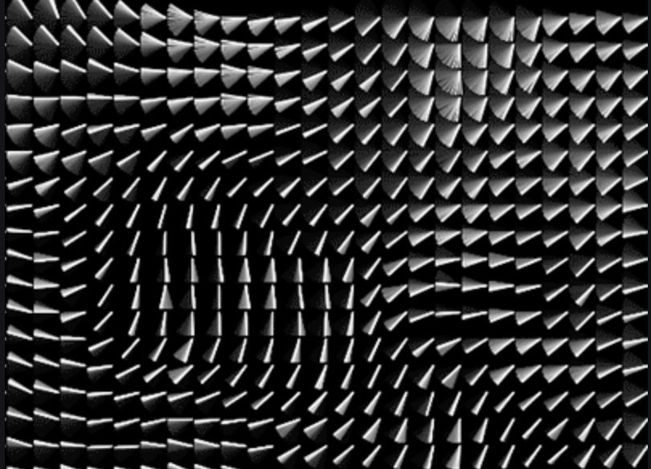
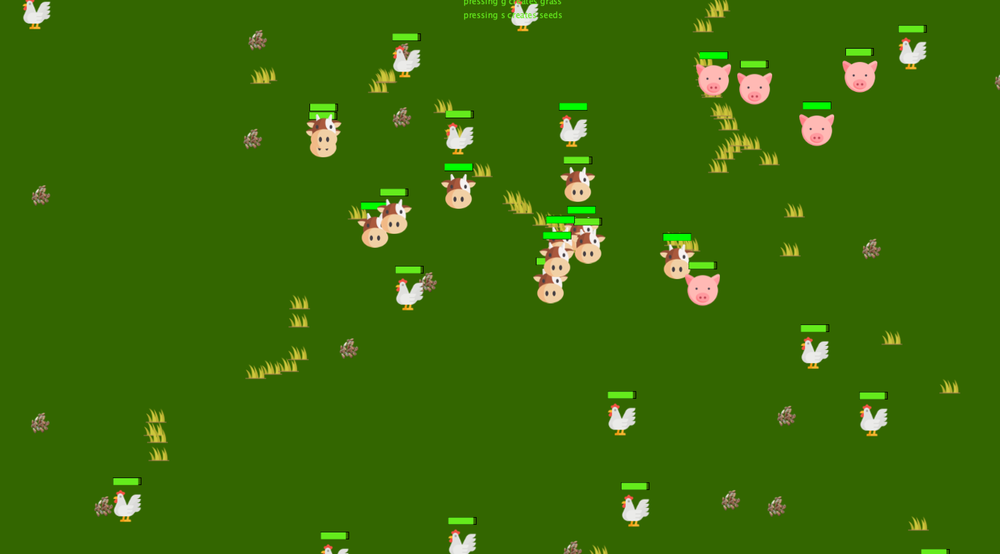
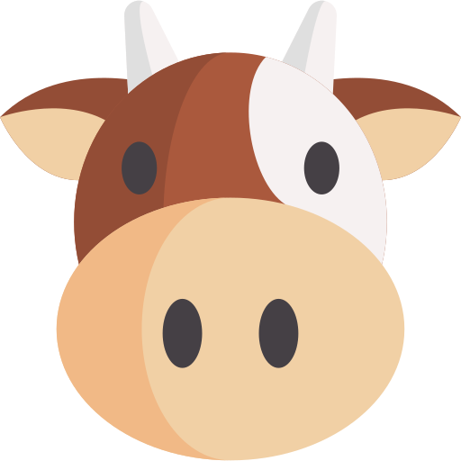
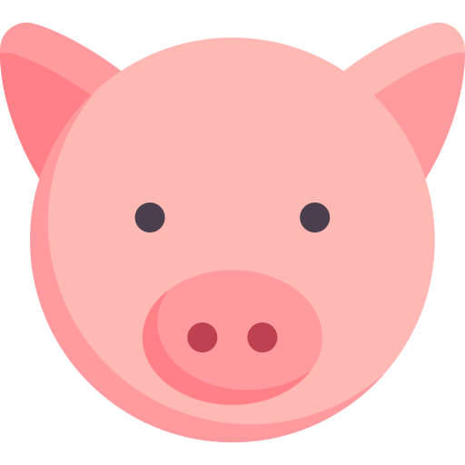
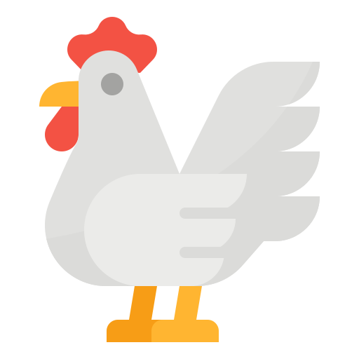
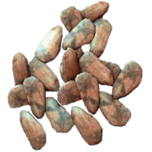
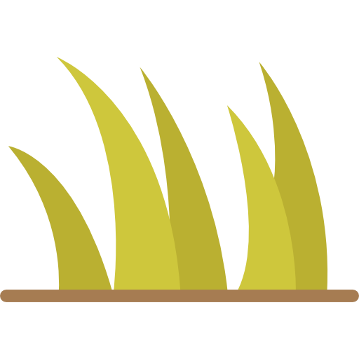

# Farm-Simulator-
This project replicates a "farm" using chickens, cows, and pigs along with grass and seeds. 

> each animal has a hunger bar over them. This causes cows to seek grass, chickens to seek seeds, and pigs to seek cows when they get hungry. 

### The grass (created by key pressing 'g') moves along the screen on a flow field. A flow field is a mesh of vectors that control the direction of the grass movements. This means that the grass tends to flock together as it travels. Cows use a seek function to seek out the grass. This causes cows to want to follow the grass and thus they move in flocks. 

### the seeds are placed randomly on the screen when the key 's' is pressed. Chickens seek these points out, however chickens avoid getting close to any other objects so it is always harder for them. 

### This is an example of the game while running: 

## These are the images: 

